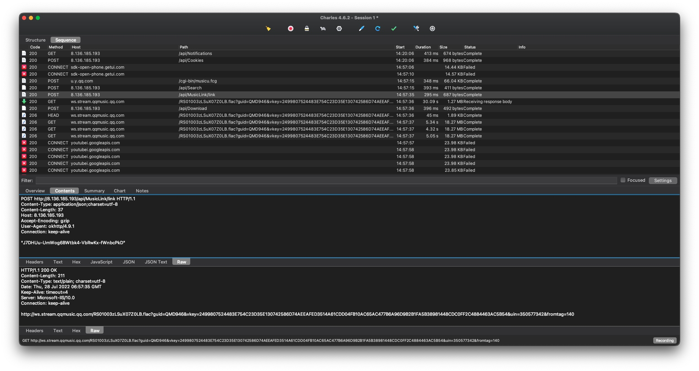
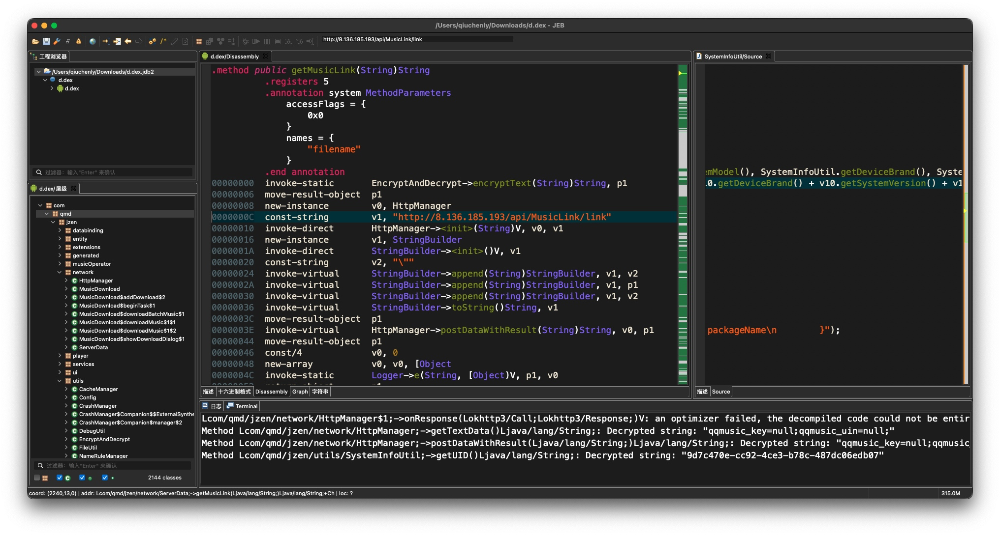
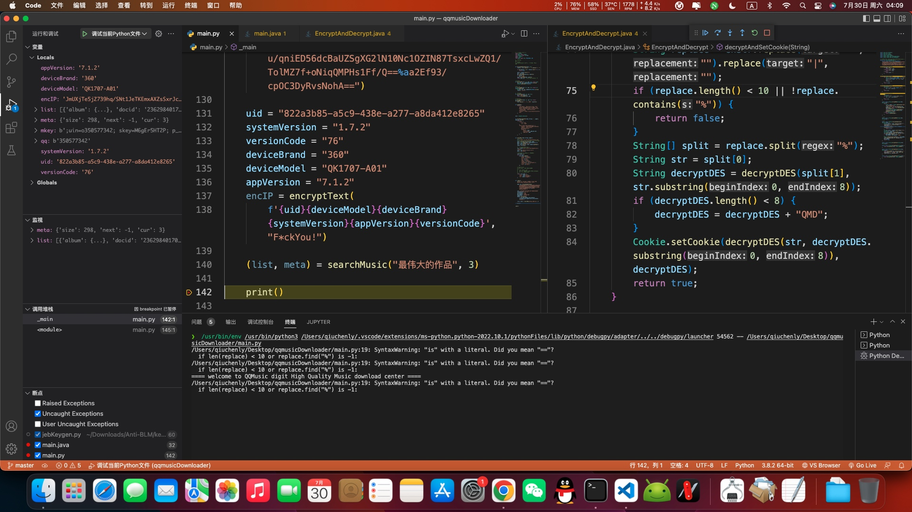
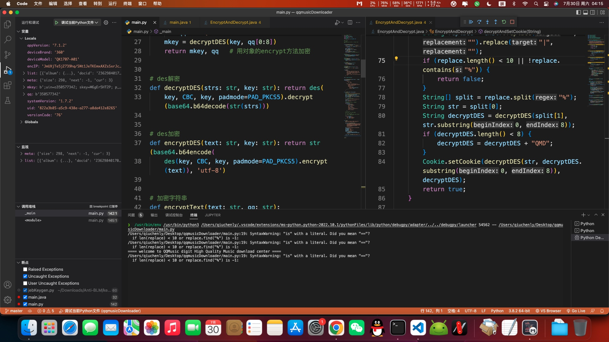
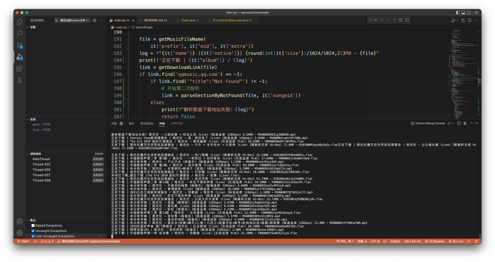
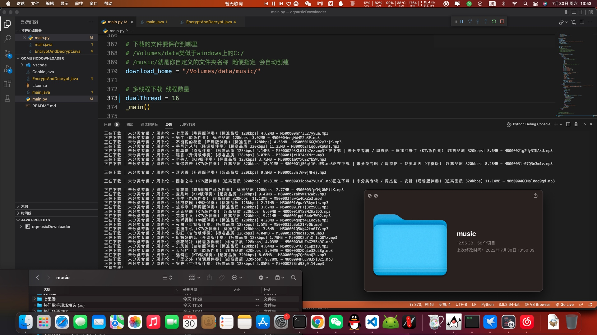
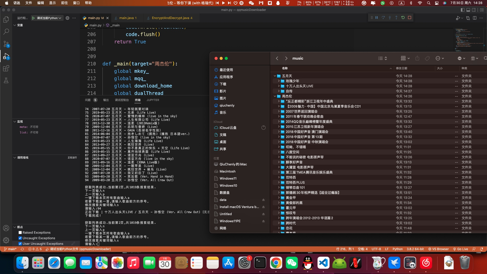

# 逆向一个 QMD QQ 音乐源下载软件

这个 Apk 主要是用来下载 QQ 音乐的无损数字音频文件，我为了把我 iMac 上的 mp3 音质音乐替换为 flac 或者 HiRes
无损，一个个去网上找文件。偶然间在网上发现了这个 app，有些好奇怎么实现的，于是做本篇分析文章。

## 第一步 反射大师脱壳

对于类似于这种神奇的软件作者总会加个壳加加固保护一下源代码，我有种直觉这玩意应该也是加了固的，果然打开 zip
文件一看：
libjiagu.so 赫然在目。。。得，直接打开反射大师先来扒一层皮看看能不能看到里面。
**反射大师脱壳过程不再赘述，直接导出内存 dex 即可。**

## 第二步 JEB 静态分析

可喜可贺，2021 年初还只有 Jeb 3.24，坐了一年牢出来发现竟然有 4.x 的版本更新了，好，很有精神！

首先我们打开 app 开始下载高解析度音频，看看加密如何。


我们关注一下上图的/api/Download 请求。
这个包是用来获取 QQ 音乐的文件实际下载地址，我们来看看这个请求：
一个迷之数据，一个朴实无华的 http 请求，再无其他。
只有下面的一个http:
//ws.stream.qqmusic.qq.com/RS01003zLSuX07Z0LB.flac接口关联他。那么为了得到这个qqmusic的源数据，我们要批量下载这些音乐就需要逆向出这个迷之数据到底是什么东西，我们如何生成它。

```
接口表

获取音乐的高解析度下载地址
/api/MusicLink/link
```

那么话不多说，jeb 直接打开导出的 dex 看函数，搜索这个字符串。


直接可以看到这个搜索结果了，很好，看来不需要再去找其他的 dex 文件了。
tab 一下看看。

关注以下函数:

```java
public String getMusicLink(String arg4) {
    String v4 = EncryptAndDecrypt.encryptText(arg4);
    String v4_1 = new HttpManager("http://8.136.185.193/api/MusicLink/link").postDataWithResult("\"" + v4 + "\"");
    Logger.e(v4_1, new Object[0]);
    return v4_1;
}
```

v4=arg4,arg4 则是一个 String 不足为惧，先看看这个写的非常漂亮的 Encryption 函数:

```java
    public static String encryptText(String arg1) {
        return EncryptAndDecrypt.encryptText(arg1, Cookie.getQQ());
    }

    public static String encryptText(String arg4, String arg5) {
        if(!TextUtils.isEmpty(arg4) && !TextUtils.isEmpty(arg5)) {
            int v1 = 0;
            StringBuilder v5 = new StringBuilder(EncryptAndDecrypt.encryptDES(arg4, "QMD" + arg5.substring(0, 8)));
            Random v4 = new Random(((long)Calendar.getInstance().get(5)));
            int v0 = v4.nextInt(4) + 1;
            while(v1 < v0) {
                v5.insert(v4.nextInt(v5.length()), "-");
                ++v1;
            }

            return v5.toString();
        }

        return "";
    }
```

他调用了 encryptText(String arg4, String arg5)函数，那么我们就可知道 arg5 是作为密码而存在的，arg4 则是 String 的原文，那么
Cookie.getQQ()这个代码则就相当的可疑。
跳转一下看看：

```java
public class Cookie {
    private static String Mkey;
    private static String QQ;
    public static String getMkey() { return Cookie.Mkey; }
    public static String getQQ() { return Cookie.QQ; }
    public static void setCookie(String arg0, String arg1) {
        Cookie.Mkey = arg0;
        Cookie.QQ = arg1;
    }
}
```

一个静态实体类，直接看 setCookie 的交叉引用看看是从 decryptAndSetCookie 函数设置密码的：

```java
    public static boolean decryptAndSetCookie(String arg5) {
        String v5 = arg5.replace("-", "").replace("|", "");
        if(v5.length() >= 10 && (v5.contains("%"))) {
            String[] v5_1 = v5.split("%");
            String v0 = v5_1[0];
            String v5_2 = EncryptAndDecrypt.decryptDES(v5_1[1], v0.substring(0, 8));
            if(v5_2.length() < 8) {
                v5_2 = v5_2 + "QMD";
            }

            Cookie.setCookie(EncryptAndDecrypt.decryptDES(v0, v5_2.substring(0, 8)), v5_2);//v5_2就是密码，由arg5参数分解而来。
            return true;
        }

        return false;
    }
```

继续跟踪交叉引用：

```java
    public boolean getCookie() {
        String v0 = new HttpManager("http://8.136.185.193/api/Cookies").postDataWithResult(new Gson().toJson(SystemInfoUtil.getDeviceInfo()));
        return TextUtils.isEmpty(v0) ? false : EncryptAndDecrypt.decryptAndSetCookie(v0);
    }
```

找到了，看来是从这个接口获取的数据，但是这个接口居然是 POST 提交，那么我们就有必要看看这个提交的数据
SystemInfoUtil.getDeviceInfo()到底是什么东西:

```java
    public static final DeviceInfo getDeviceInfo() {
        DeviceInfo v10 = new DeviceInfo(SystemInfoUtil.getUID(), SystemInfoUtil.getSystemModel(), SystemInfoUtil.getDeviceBrand(), SystemInfoUtil.getAppVersionName(), SystemInfoUtil.getSystemVersion(), SystemInfoUtil.getAppVersionCode() + "", null, 0x40, null);
        v10.setIp(EncryptAndDecrypt.encryptText(v10.getUid() + v10.getDeviceModel() + v10.getDeviceBrand() + v10.getSystemVersion() + v10.getAppVersion() + v10.getVersionCode(), "F*ckYou!"));//密码是F*ckYou!，emmmm....
        return v10;
    }
```

获取了设备的一些信息，然后调用了一个 setIp 函数，这个加密看起来像是一个接口签名防止被抓包调用接口，提高逆向成本。

直接抓包看数据，可以看出来其实就是几个字符串 appand 一起后加上密码 des，下面我们就开始先用 python 实现一下。

不过在此之前我们还要看一下 EncryptAndDecrypt.encryptText 函数，里面是如何处理的：

```java
    public static String encryptText(String arg4, String arg5) {
        if(!TextUtils.isEmpty(arg4) && !TextUtils.isEmpty(arg5)) {
            int v1 = 0;
            StringBuilder v5 = new StringBuilder(EncryptAndDecrypt.encryptDES(arg4, ("QMD" + arg5).substring(0, 8)));
            Random v4 = new Random(((long)Calendar.getInstance().get(5)));
            int v0 = v4.nextInt(4) + 1;
            while(v1 < v0) {
                v5.insert(v4.nextInt(v5.length()), "-");
                ++v1;
            }

            return v5.toString();
        }

        return "";
    }
```

清晰地看到又调用了 EncryptAndDecrypt.encryptDES 函数，还加上了“QMD”作为密码前置字符串，我们继续跟踪：

```java
    public static String encryptDES(String arg5, String arg6) {
        if(arg5 != null && arg6 != null) {
            try {
                Cipher v0 = Cipher.getInstance("DES/CBC/PKCS5Padding");
                v0.init(1, new SecretKeySpec(arg6.getBytes(), "DES"), new IvParameterSpec(arg6.getBytes()));
                return Base64.encodeToString(v0.doFinal(arg5.getBytes()), 0).trim();
            }
            catch(Exception v5) {
                return v5.getMessage();
            }
        }

        return null;
    }
```

到这里我们已经很清晰了，密码作为 iv，加密方式为 des/cbc/pkcs5padding 方式填充结果，那么我们用 python 实现一下这个加密函数：



到这里我们就用 python 写出了加密算法，接下来就可以用这个算法生成数据去请求 http 数据了。

## 第三步 测试接口访问






于是为了下载 flac，我直接写了一个 python 脚本。

```
项目地址 https://github.com/HackerZer0/python_down_jaychou
```
